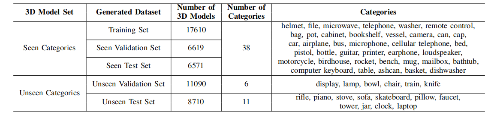
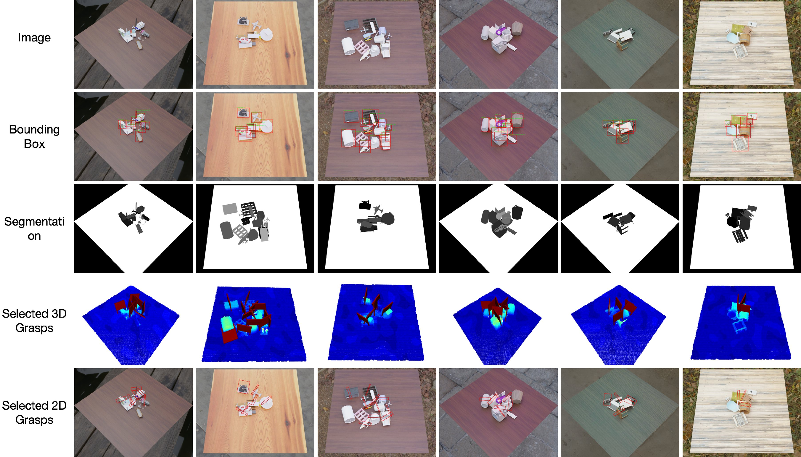

# REGRAD Dataset

## Download
⭐ [2021/12/1] We update REGRAD to [REGRAD V2](https://stuxjtueducn-my.sharepoint.com/:f:/g/personal/chaser123_stu_xjtu_edu_cn/EobRgIWiXmFJlO0k0U980XIBEwU9G7hvrSYxT3eVofpIgw?e=zKO0lA):

* We optimized the labels of manipulation relations.
* We optimized the storage of the dataset so that the complete REGRAD will be possible to be accessed online.
* We re-organized the file tree, which is currently easier to use.
* For grasp data, please refer to [REGRAD_v1](https://stuxjtueducn-my.sharepoint.com/:f:/g/personal/chaser123_stu_xjtu_edu_cn/EgT94GMlqmtHgShSnn_vxPoBMlq56mjTOkNJ-AnaXPPyrA?e=XlA8LD).

We also keep the old version of REGRAD available, which can be accessed in following link.

[2021/9] We have released part of our dataset, and you can download it at: [REGRAD_v1](https://stuxjtueducn-my.sharepoint.com/:f:/g/personal/chaser123_stu_xjtu_edu_cn/EgT94GMlqmtHgShSnn_vxPoBMlq56mjTOkNJ-AnaXPPyrA?e=XlA8LD).

## Introduction

This is the official repo for RElational GRAsps Dataset (REGRAD), a novel, large-scale, and automatically-generated dataset by considering the relationships among objects and grasps.
REGRAD has the following features:

* **More objects and categories**. Our dataset is built upon
the well-known ShapeNet dataset [10], [11], including
55 categories and 50K different object models.
* **Different kinds of modalities** including the depth im- ages and point clouds, which are helpful for relationship detection, grasp synthesis, and sim-to-real transferring.
* **Rich labels** including:
    * 6D pose of each object.
    * Bounding boxes and segmentations on 2D images.
    * Point cloud segmentations.
    * Manipulation Relationship Graph (MRG) indicating the grasping order.
    * Collision-free and stable 6D grasps of each object.
    * Rectangular 2D grasps.
* **Segregated training, validation, and test sets** including the unseen validation set and unseen test set, in which the objects belong to unknown categories.
* **Multi-view data** which releases the assumption of single-view perception since in practice the robot could move around for more precise manipulation.
* **Automatic data generation** in the physical simulator which will save much time to label the dataset and avoid the bias from the human labels. Currently, to add new objects to the datasets, we only need to scan the 3D models instead of re-collecting and labeling images.

## Splits

REGRAD includes two parts, **Relation Part**  and  **Grasp Part**. Each part contains five folders, 
*train / seen\_valid / unseen\_valid / seen\_test / unseen\_test*. Currently, our dataset contains 111.8k different scenes, and the numbers of different scenes in different splits:

| train | seen_valid | unseen_valid | seen_test | unseen_test |
| -------------| ------------- | ------------- | ------------- | ------------- |
| 47, 000 | 16, 000 | 16, 000 | 16, 000 | 16, 000 |

We also provide the detailed category information of each split, showing the list of available categories in different splits:



## Examples  



## File Tree
### Root directory

```
REGRAD
|_____ Relation Part
|__________ train
|__________ seen_valid
|__________ seen_test
|__________ unseen_valid
|__________ test
|_____ Grasp Part
|__________ 3D_Grasp
|_______________ train
|_______________ seen_valid
|_______________ seen_test
|_______________ unseen_valid
|_______________ test
|__________ 3D_Grasp
|_______________ train
|_______________ seen_valid
|_______________ seen_test
|_______________ unseen_valid
|_______________ test
```

### Relation  Part
```
split_name (e.g. train)
|_____ scene id  
|__________ id of different camera angles(from 1 to 9)
|________________ camera_info.json
|________________ info.json
|________________ rgb.jpg
|________________ segment.jpg
|________________ depth.png
|________________ labeled.jpg
|________________ minRect_labeled.jpg
|__________ final_state.json
|__________ mrt.json
```

### Grasp Part

#### 3D_Grasp
```markdown
split_name (e.g. train)
|______ scene id
|__________ *scene-id*_view_*view-id*.p (e.g. 00001_view_1.p)
```
NOTE:
*view id* is the id of the camera pose (from 1 to 9).

#### 2D_Grasp
```markdown
split_name (e.g. train)
|___scene_id
|______ view_id
|__________*view_id*.json (e.g. 1.json)
|__________*view_id*.jpg (e.g. 1.jpg)
```

## Relation Data Format

- [x] *final_state.json*  
    contains the  generated scene information including *model name*、*obj_id*、*path*、*position*. This file is necessary to
    reload the scene in relation detection.
    ```angular2
    { 'name': model_name-obj_id (e.g. tower-1),
    
      'path': model category/model path (e.g. 04460130/de08da18d316f927a72fcffccc240663),
      
      'pos': xyz postion + quaternion,
  }
    ```
- [x] *mrt.json*  
    Model relation tree. Contains every model's parent list.  
    e.g.  
    ```angular2
    {"table-1": ['birdhouse-2','mug-4'], "birdhouse-2": [], "vessel-3": ['mug-4'], "mug-4": [] }
    ```
- [x] *camera_info.json*  
    contains camera extrisinc and intrisinc parameters.

- [x] *info.json*  
    contains all models information,it is a list of dictionaries. Every
    dictionary contains all information of a model.Dict keys are as follows.  
    ```angular2
    { 'model_name':(str) ShapeNet model name(e.g. tower),
  
      'category':(str) ShapeNet category(e.g. 04460130),
  
      'model_id':(str) ShapeNet model id(e.g. de08da18d316f927a72fcffccc240663),
  
      'obj_id': (int) id in the scene(e.g. 1),
  
      '6D_pose':(7-d list of float) 6D_pose of models, format [x,y,z, quaternion],
  
      'parent_list':(list) parent obj_id list, format ['model_name-obj_id1','model_name-obj_id2'],
  
      'scale':(3-d list) model scale factor in the scene, format [x_scale, y_scale, z_scale],
  
      'bbox':(4-d list) bounding box of the model, format [x1, y1, x2, y2],
  
      'MinAreaRect':(4-d list) The smallest bounding rectangle of the model, format [[x1,y1],[x2,y2],[x3,y3],[x4,y4]],
  
      'segmentation':(2-d list) segmentation region in the segment.jpg picture, format [x_position_list, y_position_list],
  
      'Source': (str) ShapeNetCore.v2,
  }
  ```
- [x] *segment.jpg*  
    For better visualize, the segment id of a model can be  computed  with *10 obj_id +1*.  
   
- [x] *labeled.jpg*  
    visualized bounding box
- [x] *minRect_labeled.jpg*  
    visualized minimum bounding box
- [x] *depth.png*  


## Grasp Data Format

For grasping, REGRAD provides both 2D and 3D labels.

### 3D grasp

1、To load the 3D grasp data (e.g. *00001\_view\_1.p*), we need to use *numpy* as follows:

```python
data = np.load('/your/filepath/00001_view_1.p', allow_pickle=True)
```

2、In order to visualize the generated grasps in scene clearly and train the network to detect the grasps, we store three kinds of data: 

*Point data* : store the point clouds.

*Raw 3D grasp data* : provide the raw grasp data before filtering. Note that it includes both high- and low-quality grasps along with the scores of grasp quality.

*Selected 3D grasp data* : include only high-quality grasp labels after filtering along with their scores of grasp quality.

- [x] **Point Data:**

```
'view_cloud': ndarray([view_point_num, 3]) Snapshot from camera view;

'view_cloud_color': ndarray([view_point_num, 3]) RGB values for each point in ‘view_cloud’;

'view_cloud_label': ndarray([view_point_num, ]) The object label(‘obj_id’) for each point in ‘view_cloud’;

'scene_cloud': ndarray([scene_point_num, 3]) Complete scene point cloud (excluding table);

'scene_cloud_table': ndarray([scene_point_num+table_point_num, 3]) Complete scene point cloud (including table);
```

- [x] **Raw 3D grasp data:**

```
'valid_frame': ndarray([sampled_point_num, len(LENGTH_SEARCH),len(THETA_SEARCH), 4, 4]) A set of generated grasp candidates on sampled point; each grasp is represented by a rotation matrix (a frame) with a shape of 4x4. Format:
[[normal[0],principal_curvature[0],minor_curvature[0],-center[0], 
[normal[1],principal_curvature[1],minor_curvature[1],-center[1], 
[normal[2],principal_curvature[2],minor_curvature[2],-center[2],  
[0,    0,           0,         1]]

'valid_index': ndarray([sampled_point_num, ]) The index of the sampled points in ‘view_cloud’;

'antipodal_score': ndarray([sampled_point_num, len(LENGTH_SEARCH),len(THETA_SEARCH)]) The force closure property of a grasp;

'vertical_score': ndarray([sampled_point_num, len(LENGTH_SEARCH),len(THETA_SEARCH)]) The verticality between the grasping direction of the gripper and the table (It is more stable to perform grasping perpendicular to the desktop);

'center_score': ndarray([sampled_point_num, len(LENGTH_SEARCH),len(THETA_SEARCH)]) The distance between the grasp point and the center point of the object (It is more stable to perform grasping near its center);

'objects_label': ndarray([sampled_point_num, len(LENGTH_SEARCH),len(THETA_SEARCH)]): The object label(‘obj_id’) of the sampled grasp points.
```

Note:

1. *sampled\_point\_num* : since using the full point cloud is inefficient, we firstly down-sample the point cloud to get a subset of points for each scene, based on which we generate the candidate grasps.

2. By sampling different gripper orientations around the approaching vector as well as the gripper depths, we generate a set of grasp candidates on each grasp point.

   *LENGTH_SEARCH* : to sample grasps, the gripper depths are taken from the set of -0.06, -0.04, -0.02, -0.00, therefore len(*LENGTH_SEARCH*)=4.

   *THETA_SEARCH* : the gripper orientations are sampled every 20 degrees from -90 to 90 degrees. Therefore  len(*THETA_SEARCH*)=9.

- [x] **Selected 3D grasp data:**

```

'select_frame': ndarray([selected_grasp_num, 4, 4]) the selected high-quality grasps, format 
[[normal[0],principal_curvature[0],minor_curvature[0],-center[0], 
[normal[1],principal_curvature[1],minor_curvature[1],-center[1], 
[normal[2],principal_curvature[2],minor_curvature[2],-center[2],  
[0,    0,           0,         1]]

'select_score': ndarray([selected_grasp_num, ]) the score of grasp quality corresponding to the selected grasps.

'select_antipodal_score': ndarray([selected_grasp_num, ]) selected antipodal_scores

'select_center_score': ndarray([selected_grasp_num, ]) selected center_scores

'select_vertical_score': ndarray([selected_grasp_num, ]) selected vertical_scores

'select_frame_label': ndarray([selected_grasps_num, ]) The object label(‘obj_id’) of the selected grasp points.
```


### 2D garsp

We project 3D grasp data (‘select\_frame’) to the image and filter them by ‘select\_vertical\_score’ with the threshold 0.5. But we cannot guarantee that there are always grasps in every 2D image. Therefore, some files are possibly missing.

1、*view_id*.json contains a list of 2d grasps. Each grasp includes the object label('obj_id'), the rectangular grasp box, and the corresponding grasp scores.
for example:

```
[
  # grasp 1
  [
    obj_id, 
    [[center-x, center-y], [width, height], theta], 
    [select_vertical_score,select_center_score,select_antipodal_score, select_score]
  ]
  # grasp 2
  [
    obj_id, 
    [[center-x, center-y], [width, height], theta], 
    [select_vertical_score,select_center_score,select_antipodal_score, select_score]
  ]
...
]
```
2、*view_id*.jpg contains the visualized 2D grasps.
